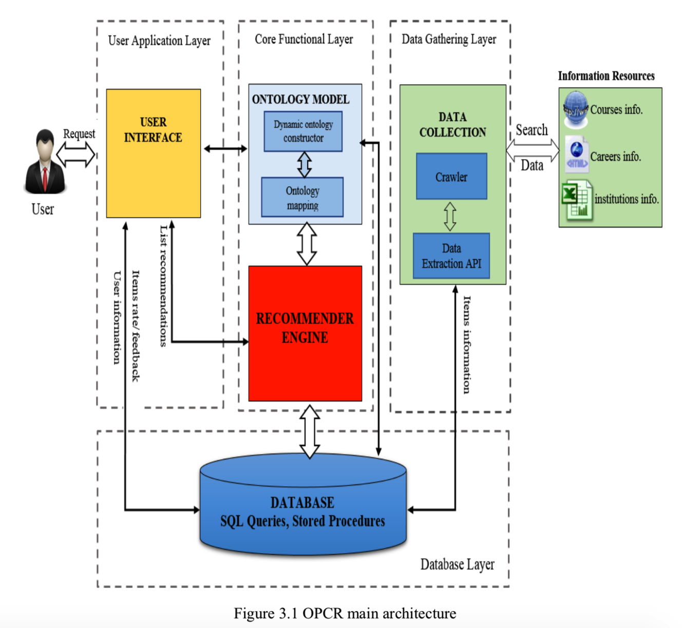
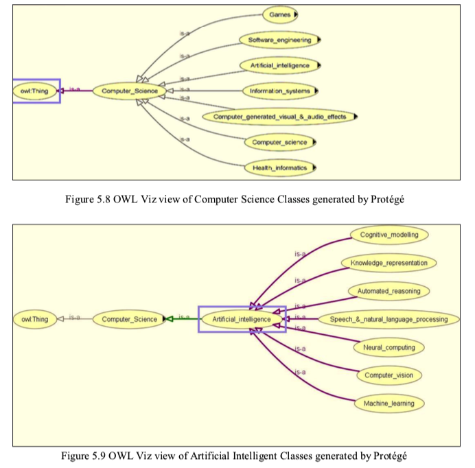
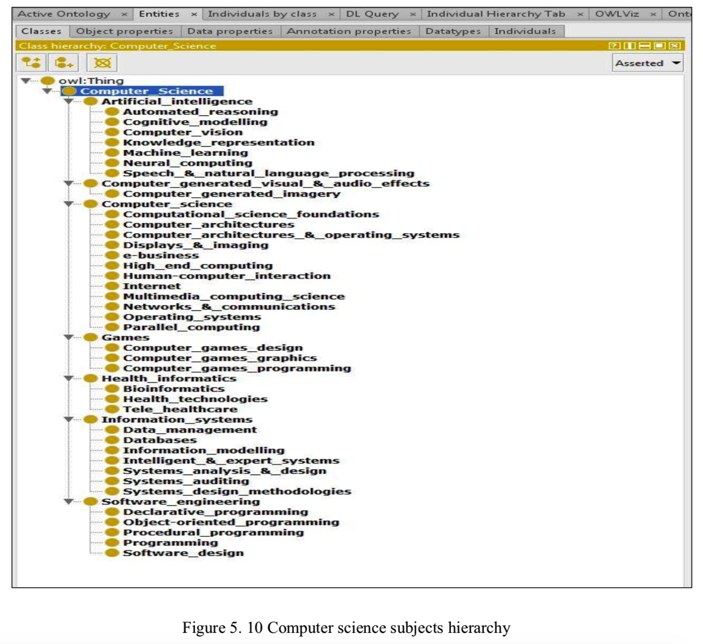
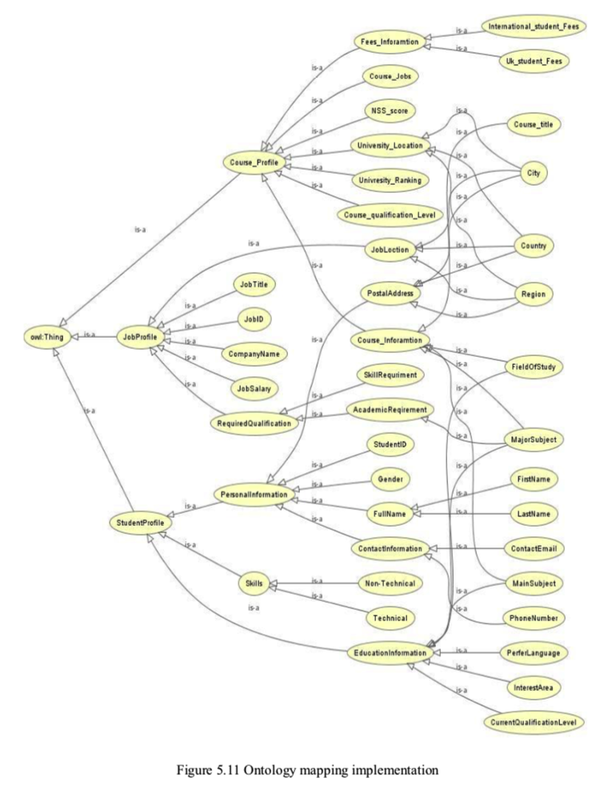
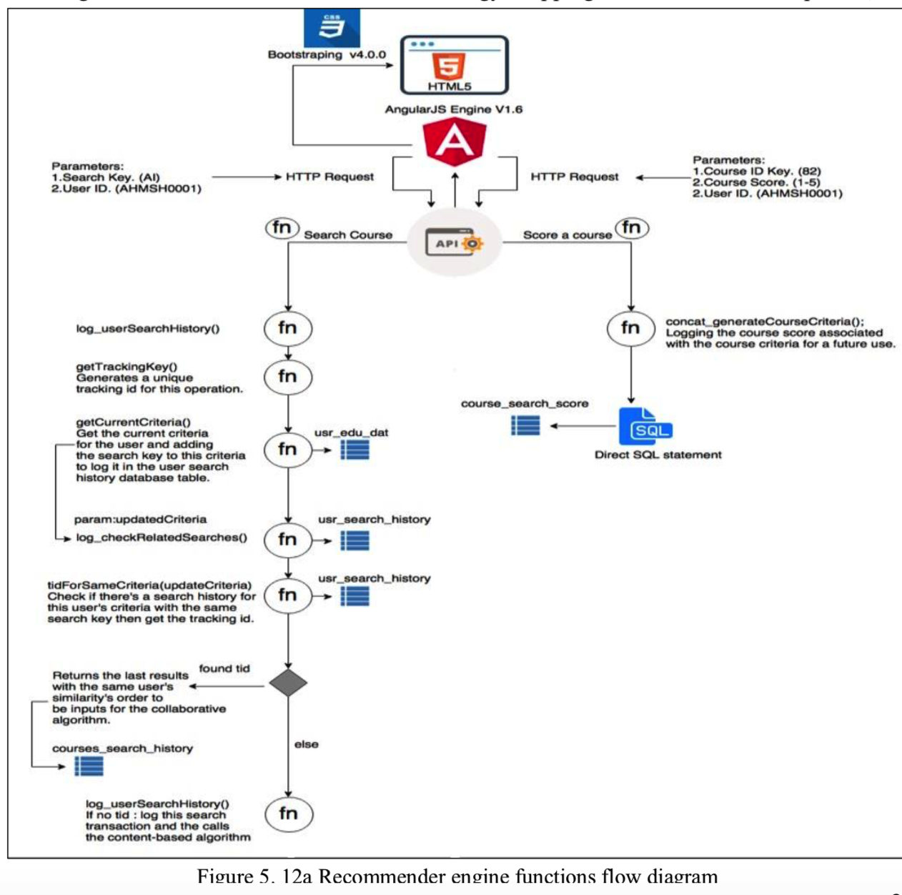

# An_Ontology_based_Hybrid_Approach_to_Course_Recommendation_in_Higher_Education

博士论文：An_Ontology_based_Hybrid_Approach_to_Course_Recommendation_in_Higher_Education

论文中要搜索的

https://digital.ucas.com/search

 这个网站还挺好的

## 摘要

网络上可供学生使用的与课程相关的信息的数量和复杂性都在迅速增加。随着用户发现越来越难找到相关信息，这种潜在的信息过载挑战了标准信息检索模型。教育领域是受此问题影响的主要领域之一。对于学生来说，选择大学的高等教育课程可能非常繁琐且极其复杂。个性化的推荐系统可能是向潜在学生推荐相关课程的有效方法。现有的主要基于关键字的方法无法满足推荐过程中单个用户的需求。尽管模型使用协作过滤，但通常缺少历史信息。另一个缺点是他们没有提供与学生最相关的课程的全面知识。

这项研究提出了一种新颖的基于本体的混合方法，通过整合有关课程的所有可用信息并支持学生根据自己的职业目标选择课程，从而推荐个性化课程以满足学生的个性化需求。本论文做出了三个主要贡献：首先，通过结合协作过滤，基于内容的过滤，本体表示和知识管理等多种人工智能技术，提出了一个基于本体的全面的个性化课程推荐框架，称为OPCR。开发了一套基于本体的推荐算法，用于个性化推荐。该框架能够自动提取，集成数据，以向学生提供适合他们需求的建议。它不仅减少了信息过载，而且提高了推荐准确性。其次，提出了本体模型，用于从多种来源提取和整合信息，通过克服课程信息的异质性，有助于提高推荐的质量。此外，它还具有诸如通用性之类的属性，使其可以在不同的推荐系统域中使用，这些域会随用户的兴趣和对象的属性而变化。最后，开发并评估了基于OPCR框架的个性化推荐系统。该系统可在线访问，以供研究人员和开发人员使用。结果表明，与仅考虑关键字相似性的过滤方法相比，使用分层相关概念的基于本体的推荐算法可产生更好的结果。此外，利用项目的个人资料和用户的个人资料之间的本体相似性，可以提高系统的性能。

## 宣言

尽管已注册为上述学位的候选人，但我尚未获得任何其他研究奖的注册。 本文所体现的结果和结论是指定候选人的工作，尚未获得其他任何学术奖项。

## 致谢

首先，我要感谢宇宙的创造者，最仁慈和最仁慈的人，没有他的意志，我将不可能实现我希望获得博士学位的愿望。

我要感谢许多启发了我个人和职业的人。首先，我要感谢我的第一任主管Linda Yang博士，他向我介绍了人工智能和信息检索系统领域。没有她对我的巨大信心，我将永远没有勇气继续进行方法论和理论研究。没有她的帮助，我几乎想不出什么成就，而且她为我提供了自主探索新想法的自由。在过去的四年中，我得到了她的指导，鼓励，宽容，自由，信任，热情好客和她的友谊。

我还要感谢朴茨茅斯大学技术学院的工程学院为我提供了高质量的研究环境。我也感谢我的同学们的鼓励和友谊。我要感谢斯坦福大学的所有朋友和Protege工具的成员，特别是Michael和Alexander在整个本体模型开发过程中提供的帮助，支持和宝贵见解。我感谢我的同事和其他研究人员对本论文的间接或直接贡献。我热烈感谢我的同事们，尤其是工学院的博士生，他们的帮助和支持（海德，穆尔塔达，马吉，西克里，阿里，迈克尔，马哈茂德，白头翁，谢内多，艾哈迈德等）。我非常感激由伊拉克伊拉克教育发展高级委员会（HCED）赞助的使我的博士工作成为可能的资金来源。

我要对父母，兄弟姐妹的长期支持和鼓励，尤其是他们多年来的对我的信任深表谢意。我的父母，我永远无法感谢您为我所做的一切。我也非常感激我挚爱的妻子Zahraa Albayati，他一直陪伴着我，为帮助我继续学业做出了巨大的牺牲。感谢您的耐心和关心，因为您，我的生活充满了爱和幸福。最后，我想向我美丽的儿子Warth和Siraj表达我的爱意，感谢他们在博士期间的耐心和理解。

# 章节1 介绍

本章讨论了动机，这些动机表明了本研究针对要解决的问题的及时性以及研究旨在达到的目的和目标。 随后，突出了本论文在知识和技术方面的贡献。 最后，说明了本文的内容。

## 1.1 动机

从理论上讲，数字内容的不断增长将增加发现符合个人需求的内容的机会。但是，传统信息系统的用户可能会遇到信息过载的情况，因为只有少数几个项目在用户感兴趣的领域内（Bollen，Knijnenburg，Willemsen和Graus，2010年）。

研究表明，选择课程时，学生会因大量可用信息而超负荷工作（Huang，Chen和Chen，2013年）。当交流了超出处理能力的大量信息时，就会发生信息过载。利用教育技术的先进特性，可以以多种格式和不同类型的信息资源访问更高效，更复杂的信息环境。信息的传播给学生带来了过多的信息（Kalyuga，2011年）。如今，可供学生使用的与课程相关的信息范围正在迅速增加（Bhumichitr，Channarukul，Saejiem，Jiamthapthaksin和Nongpong，2017年）。从大量网站中查找与课程相关的信息是一个艰巨而耗时的过程。有效的搜索将包括有关课程内容，教育机构和有关特定课程主题的职业信息的所有相关信息。帮助学生从众多可用课程中做出正确选择，以满足他们的个性化需求是一个真正的挑战（Huang，Zhan，Zhang和Yang，2017）。

如此丰富的信息意味着学生需要搜索，组织和使用可以使他们符合个人目标，兴趣和当前知识水平的资源。这可能是一个耗时的过程，因为它涉及访问每个平台，搜索可用的课程，仔细阅读每个课程的课程提纲，然后选择最适合学生的课程（Apaza，Cervantes，Quispe和Luna，2014年）。大量的信息导致需要帮助学生选择，组织和使用与他们的目标，兴趣和知识相匹配的资源（Farzan＆Brusilovsky，2006）。 Bendakir和Aïmeur报告说，追求教育的学生面临着两个挑战：无数的课程可供选择，以及对要遵循的课程和顺序的知识缺乏（Bendakir＆Aımeur，2006年）。

选择课程的过程可能非常繁琐且极其复杂。 如今，学生可以使用在线资源快速找到与大学及其提供的课程有关的信息（Huang等，2013）。 但是，仅仅因为现在可以从大学网站上获得更多课程信息并不能自动意味着学生具备对所有课程进行评估的认知能力（Ibrahim，Yang和Ndzi，2017年）。 相反，他们面临着一个被称为“信息超载”的问题（Z. Zhang，Zhou，＆Zhang，2010）。

在研究开始时开发的人工智能方法现已应用于信息检索系统。 推荐系统（RS）提供了一种有前途的信息过滤方法（Garcia，Sebastia和Onaindia，2011），因为它们可以帮助用户找到最合适的项目（Jannach，Zanker，Felfering和＆Friedrich，2011）。 当前有许多在线系统可用于查找和搜索课程。 但是，这些方法都没有针对性地向用户提供个性化建议，这些建议提供有关特定相关课程的全面信息。

这项研究的动机之一是减少用户希望选择大学课程时面临的信息过载。 教育信息以不同的格式在互联网上发布，因此要提取出符合用户搜索查询的有用信息，这是一个巨大的挑战（Alimam＆Seghiouer，2013）。 课程信息和个人用户需求的异质性使得决策过程非常繁琐和复杂。 测量项目概念的本体层次结构是一种有前途的方法，可以帮助解决异质性问题（Bach＆Dieng-Kuntz，2005）。

此外，尽管某些课程标题相似，但每种标题可能会导致不同的职业道路（DS＆K，2015）。桑德维格（Sandvig）和伯克（Burke）在他们的研究工作中指出，缺乏从大量物品中选择哪个合适项目的知识，这意味着人们需要寻求顾问或指导（Sandvig＆Burke，2005）。提供有关用户可能希望选择的满意商品的全面知识是另一个挑战，因为用户品味和偏好的差​​异会影响用户的满意度。例如，寻求选择大学课程学位的人将需要获取有关课程的相关信息，而不仅仅是课程主题内容，还包括大学的声誉，所提供的设施，职业机会等。因此，需要建立一个能够从多个来源提取和集成信息并以统一的形式对齐这些数据的综合框架，这是本研究的另一个动机。

推荐系统为信息过滤提供了一种有前途的方法（Garcia等，2011），因为它们可以帮助用户找到最合适的项目（Jannach等，2011）。根据每个用户的需求，推荐系统将生成一系列具体建议（Ren，Zhang，Cui，Deng和Shi，2015）。推荐系统已被用来提供各种领域的推荐，例如电子商务，新闻，电影，音乐，研究论文，课程资料等。教育领域已将推荐器系统用于不同目的，例如电子学习应用程序，学术建议，课程材料建议等。当前有许多在线系统可用于查找和搜索课程（S. Wang和Sapporo，2006年），这些系统使用基于用户对课程的先验知识（H. Zhang，Yang，Huang和Zhan， 2017），基于关键字的查询（Khan，2000; ucas.com，2018），协作过滤（CF）（Carballo，2014）（T. Huang et al。，2017），数据挖掘和关联规则（Noakes，Arrott， ＆Haakana，1968; H.Zhang et al。，2017）和基于内容的过滤（CBF）模型（Lotfy＆Salama，2014）。尽管现有的课程推荐系统具有很强的影响力，并且它们可以发挥多大作用，但仍然存在某些重大限制，例如：

- 主要基于关键字的模型无法满足推荐过程中单个用户的需求。

- 尽管模型使用协作过滤和数据挖掘（例如关联规则和决策树），但是通常缺少历史信息，这使得采用这种方法具有挑战性。 例如，希望使用该系统的新学生没有关于模型的足够信息，因此无法生成任何建议。

- 使用基于内容的筛选的模型的缺点是，当前的方法仅基于特定的学科推荐，而不是整个大学课程。 此外，这些模型中的相似性计算基于功能的加权平均值，并且未考虑用户与系统的交互（例如等级）推荐项目的价值。

- 当前模型的另一个缺点是它们无法提供与学生最相关的课程的全面知识。 例如，学生需要知道该课程将导致什么未来的职业，并需要有关此方面的信息以及将提供该课程的教育机构本身的设施质量。

对学生的需求及其感兴趣的领域进行分类可以推荐适当的课程。 通过开发既可以整合来自多个异构数据源的数据，又可以快速建立有价值的与课程相关的信息的方法，可以帮助学生选择一门课程（Huang等，2013）。

所有这些事实为开发一种新方法以克服信息超载现象并获得有关推荐项目的全面知识提供了动力。 需要解决两个研究问题。 首先，如何整合有关课程的所有可用信息，包括课程模块，工作机会和用户兴趣，以及如何在相关信息之间建立关系。 其次，利用所有综合信息，如何推荐最相关的课程以满足用户的个性化需求。

## 1.2 目的

本文旨在解决信息超载问题。 它基于研究中提出的方法开发了一个实用的框架，该框架可以在教育推荐系统的范围内产生实际应用。 该框架支持数据集成和课程推荐应用程序。 涉及算法，可以基于从多个来源集成的数据来生成智能课程推荐。 最终目的是能够从各种数据源中提供个性化推荐，并着重于学生选择课程时的个人需求。

论文研究的目的可以分为以下几个具体目标：

1. 研究推荐系统的技术水平，特别是关注那些已在教育领域应用的推荐系统。 在选择合适的课程以满足他们的个人需求时，还要研究可用于帮助学生进行决策的工具。

2. 要研究偏好建模的工具，重点研究采用用户概要文件的方法，并主要分析它们如何处理概要文件的初始化和动态更新问题。 设计模型以动态管理用户和项目资料，从而改善常规推荐系统的性能。

3. 开发一种方法来集成来自多个异构数据源的数据，这将使用户能够根据用户的偏好快速访问有价值的课程相关信息，从而帮助用户选择与其职业方向相关的课程。

4. 开发一个框架，供计划选择大学课程的有远见的学生使用。 该框架应能够通过结合不同类型的推荐技术来提供满足每个学生需求的个性化推荐。 它应该能够支持自动数据提取，集成和个性化课程建议。

5. 基于该框架，设计和实现个性化的课程推荐系统，以证明所提出的方法在实际应用中的可行性。

## 1.3 主要贡献

这项研究解决了现有的空白，并研究了一种方法，该方法可基于本体技术自动提取和集成课程信息，并通过减少教育领域的信息过载来提高推荐系统的性能。 将本体领域知识整合到推荐过程中是可以克服常规推荐系统局限性的解决方案之一。 基于本体的（OB）推荐器系统是基于知识的，并使用本体来表示有关推荐过程中项目和用户的知识。 此外，基于本体，项目本体和两个本体之间的语义相似性的用户配置文件用于克服新的用户问题。

本论文的主要贡献在于以下几点：

1. 通过增加对通常如何解决现有问题以及为何仍然存在缺点的见解，它有助于增加当前推荐系统的知识。

2. 它结合了几种人工智能技术，包括协作过滤，基于内容的推荐，本体表示和知识管理，定义了一个新颖的基于本体的个性化课程推荐（OPCR）框架。 开发了一套基于本体的推荐算法，用于个性化推荐。 因此，该框架能够自动进行数据提取，集成和个性化课程推荐，从而为学生提供满足其需求的合适建议。 它不仅旨在提高精度指标，而且还旨在减少信息过载。

3. 旨在从多个来源提取和整合信息的本体模型通过克服课程信息的异质性，有助于提高建议的多样性。 此外，它还具有诸如通用性之类的属性，可将其用于随用户兴趣和对象属性而变化的不同推荐系统域中。

4. 开发并评估了个性化推荐系统。 该系统可在线使用，对用户开放。

## 1.4 论文组织

本论文组织如下。

第一章绪论介绍了作品的情境，并简要说明了其动机。阐明了一般概念，并提供了对论文贡献的描述。

第2章讨论了背景细节以及有关推荐系统和本体论方面的工作和研究。它还重点介绍了不同的推荐算法以及一般推荐系统（尤其是在教育领域）所面临的主要挑战。注意力主要集中在基于协作和基于内容的系统上，指出了每种模型的优缺点，并提供了对推荐系统领域研究趋势的分析。

第3章非常详细地介绍了基于本体的个性化课程推荐（OPCR）框架及其组成部分，构成了这项工作的核心。

第4章扩展了提出的本体模型及其模块，并详细讨论了框架中使用的推荐过滤算法。

第五章继续介绍实际的推荐系统，即OPCR及其中间步骤，直到产生推荐，然后再执行此结果。

第6章详细讨论了OPCR评估的不同方法，然后讨论了用户满意度的测量结果。

第七章总结了论文的目标，定义了研究成果，最后对本研究的未来方向进行了分析。

最后，论文包括用于详细说明的书目参考以及提供与论文相关的信息的4个附件。

## 章节3 OPCR: ONTOLOGY-BASED PERSONALISED COURSE RECOMMENDATION FRAMEWORK

### 3.1 介绍

对于学生来说，选择大学的高等教育课程并非易事。各大学开设的课程广泛，其授课方式和入学要求各不相同。从大量网站中找到有关高等教育的相关信息是一个艰巨而耗时的过程。帮助学生从众多可用的课程中进行正确选择，以满足他们的个性化需求，这是一种测试体验。如此丰富的信息意味着学生需要搜索，组织和使用资源，以使他们能够适当地匹配其个人目标，兴趣和当前知识水平。这可能是一个耗时的过程，因为它涉及访问每个平台，搜索可用课程，仔细阅读每个课程提纲，然后选择最适合学生的课程。但是，仅由于大学现在在其网站上提供了更多的课程信息并不能自动意味着学生具有评估每门课程的认知能力。相反，他们面临着一个称为“信息超载”的问题。为了解决这个问题，现在将人工智能方法应用于信息检索系统。推荐系统为信息过滤提供了一种有前途的方法，因为它们可以帮助用户找到最合适的项目。根据每个用户推荐系统的要求，可以生成一系列特定的建议。因此，个性化推荐系统可以是向潜在学生推荐相关课程的有效方法。

当前有许多在线系统可用于查找和搜索课程，这些课程使用基于用户对课程的先验知识和基于关键字的查询使用的工具。但是，这些方法无法满足推荐过程中单个用户的需求。此外，模型使用协作过滤和数据挖掘（例如关联规则），并且由于经常缺少历史信息，因此采用这些方法具有挑战性。例如，希望使用系统的新生没有足够的关于模型的信息，因此无法提供建议。另一方面，使用基于内容的筛选的方法仅关注特定的学科推荐，而不关注整个大学课程。此外，这些模型中的相似度计算基于功能的加权平均值，并且未考虑用户与系统的互动，例如推荐商品的评分值。

本章介绍了一种新颖的方法，可以个性化课程建议，从而使用户的个人需求得到适当匹配。所提出的方法已经开发了基于本体的混合过滤系统的框架，即基于本体的个性化课程推荐（OPCR）。 OPCR是用于创建基于知识的推荐系统的模块化框架，该系统利用本体作为其知识来源。这种方法背后的动机不仅是克服专家对此类系统的自动化和维护所施加的限制，而且还要通过使用用户配置文件和用户配置文件之间的本体匹配来解决系统新用户遇到的冷启动问题。课程资料。所提出的架构在可能的情况下利用AI来获取所需的信息，以尽量减少本体所需的任务。 OPCR通过实际上限制学生必须选择的可用课程来解决信息过载的问题。此外，OPCR在用户配置文件和课程配置文件之间使用动态本体映射，从而减少了搜索相关课程所花费的时间，并提高了系统性能。

本文提出了一种基于本体的混合推荐方法。 该方法首先旨在基于本体从多个来源提取和集成信息。 然后将信息源分为三个主要来源： 课程信息源，学生信息源和职业信息源。 使用本体集成该信息将获得最佳结果。

此外，第二个目标是在用户配置文件和项目配置文件之间建立动态本体映射，这将有助于减少信息过载。 为了向用户提供适当的建议，已经将两种主要的过滤方法（CBF和CF）进行了组合，因此结果是基于内存的方法和基于模型的方法的组合。 在CF中，几种技术（例如基于本体的用户配置文件，项本体和KNN）用于克服信息过载问题并提高可伸缩性和准确性。

另一方面，基于项目的本体和语义相似性被应用在基于内容的过滤中，以解决新的用户问题并提高准确性。 最终目标是提出建议列表，并要求用户为每个建议分配等级。 然后，用户在推荐列表上提供反馈并进行重新排名。 用户反馈已用于评估系统并提高其准确性，如评估一章中更详细地显示。 这项工作旨在通过将混合方法（CBF和CF）与增强的本体相结合来提高推荐系统的准确性和性能。

### 3.2 框架结构设计

OPCR是为需要为特定学生确定相关大学课程计划的情况而构建的。在其范围内，相关内容的定义以及资格的可能使用由课程如何满足学生的个人需求来定义。该框架非常灵活，因为它可以适应任何满足具有“客观地”相关项目的特定要求的项目领域。尽管差异可能不会立即显现出来，但通常会在完全主观的基础上选择“相关”课程，例如在选择周末看哪部电影或购买书籍或衣服时。在这种情况下做出一般性建议是没有根据的，但是在选择诸如BSc，MSc等大学课程时，情况却大不相同。在课程选择过程中，可以找到一些特定的特征来量化，例如大学的排名或位置。此外，学位的预期用途定义了课程的入学要求，课程费用应与学生的预算相匹配，并且课程单位/模块应具有相关性。关于课程选择的其他重要因素是提供课程的大学所在的位置以及完成课程后可获得的就业类型。在选择最合适的大学课程时，所有这些因素都会影响决策过程。根据每个学生的个人需求，因素会有所不同。因此，在设计OPCR时要考虑到这些相关因素。

拟议的基于本体的个性化课程推荐框架（OPCR）致力于通过利用混合过滤方法向学生推荐课程，该方法将基于内容的过滤和基于协作的过滤结合了本体支持。如图3.1所示，OPCR由四个主要层组成。第一层是数据收集，由所有信息资源和数据收集模块组成。这用于从多个来源提取有用的信息。第二层是用于存储所有项目和用户信息的数据库。中间层是核心功能部分，包括本体数据模型和推荐引擎。这些组件的每一个将在以下各节中详细说明。最后一层是用户应用程序层，由用户界面组成，该用户界面负责用户与框架的交互，搜索项目并提供对推荐列表的反馈。框架中的每个层和模块都基于每个层的输入和输出，相互链接和交互。该框架包括以下步骤：

（1）从系统的多个来源中提取所有有用的信息。
（2）通过提取有关课程功能的所有有用信息并在系统数据库中组织这些信息来构建课程的档案。考虑课程特征的本体层次结构。
（3）通过显性和隐性方法获取学生信息来建立学生档案。已经确定了不同的用户属性，这些属性可用于将学生介绍给OPCR系统以及推荐课程的用户评分。
（4）建立动态本体映射，以链接用户资料和项目资料。
（5）通过本体匹配和余弦相似度分析用户查询并计算用户简档和课程简档的相似度。
（6）使用协作过滤技术，以通过使用基于本体的k最近邻（OKNN）算法来获得与当前用户相似的前N个用户。

最后一步向用户建议了推荐的课程列表，并从用户那里获得反馈。 以下各节说明了每个步骤的目的。 所有使用开源免费技术（OSFT）完全开发的模块都以传统的客户端-服务器结构组织。 该系统最新颖的方面是不同技术的精心组合，这导致了应用程序的开发，该应用程序以有效的方式使用先进的人工智能技术，执行时间短。 这些技术完全对那些只与易于使用的客户端应用程序进行交互的用户隐藏，该客户端应用程序在地图和列表上显示了非常易于管理的信息。

框架的模块化允许交换组件，而实际上不需要对系统其他部分进行任何修改。 例如，可以将Web爬网程序功能与预先存在的数据库交换，只要该数据库包含所有必需的信息即可。 这也使每个组件的独立修改和扩展成为可能。 例如，数据集合负责从网页中提取课程数据，但它是如此灵活，以至于它可以用于提取不同域中的任何数据，而仅需对项目属性进行某些修改。 而且，本体模型可以很容易地适应于在任何领域中使用。 以下各节将更详细地讨论每个模块。

## 3.3 主要组件

本节介绍了从服务器方面为框架开发的所有模块，包括数据收集模块，本体模型和推荐引擎，如图3.1所示。 这些模块中的每个模块都按顺序并相互关联地工作。 在以下小节中，将说明每个模块的结构，并描述每个模块的输入/输出数据。

## 章节5 实验和结果

为了评估OPCR框架，使用Java编程语言实现了一个基于Web的原型系统。OPCR框架中的所有模块都是在后端使用开源工具实现的。原型系统被标记为OPRCourse，它是一个基于java的应用程序，具有web界面。利用protégé工具构建并验证了本体模型。实验中使用的数据都是从多个数据源中提取的实时信息。原型应用程序可通过位于oprscourse.ee.port.ac.uk的朴茨茅斯大学子域公开访问。在分析完成之前，该网站一直处于活动状态。为了实现课程领域和作业领域的数据集成，实现了基于web爬虫的本体。爬网程序可以在许多不同的域中使用，并对后端代码进行某些更改，以便与域的要求相匹配。所有代码都可以在github.com的author帐户上通过以下链接供开发人员和研究人员使用：

https://github.com/mohammediraq/OPCR

本章介绍了原型系统的实现，首先介绍了原型系统的全部操作功能，从UCAS等教育机构收集的数据开始，接着进行本体模型的构建和本体映射，最后给出评分和建议。
原型应用程序是在Windows 7下的Intel（R）Core（TM）2dup处理器上实现和运行的，该处理器的CPU为3.20ghz，内存为16gb。HTML用于系统接口，MySQL服务器用于分配系统数据集和用户评级。protégé工具还用于评估系统中构建的本体

### 5.1 Data Source and Configuration

在该系统中，用于实现OPCRa的所有数据都来自免费的开源资源。课程信息是从UCAS.com网站提取的，工作信息是从reast.com网站提取的。NNS分数信息来自officeforstudents.org.uk网站，大学排名信息来自guardain.com。然而，这些信息大多是非结构化的。为了组织这项工作，我们设计并定制了一个网络爬虫程序。利用收集到的数据，基于获取的知识，构建项目本体（课程和作业）。没有现有的特定数据集，可以应用于设计模型中实现。因此，创建了一个名为ontologyset的数据集，其中包括从UCAS.com提取的课程。然而，不需要建立一个基准数据集来评估OPCR的性能。系统元数据包括ontologyset的近21000个在线课程，涵盖了从UCAS.com存档的70个不同主题领域。这些都是从联合王国各大学和学院的不同部门选择和下载的，用于测试目的。细目是从这些学科领域中挑选出20门课程，但决定使用计算机科学和商业管理课程。课程科目按高等教育科目分类法（HECoS）进行分类。请参阅附录A和表A.1和表A.2，表A.1和表A.2显示了信息技术、商业和管理领域的科目分类。数据集中的课程涵盖所有研究生学术水平，产生了一套具有代表性的课程，其中包括在不同大学提供的各种课程。对于工作信息，确实网站被用作提取工作信息的来源。此信息包括职务、说明、薪资、位置和用户评论。出于测试目的，提取了与CS和BAM课程相关的任何作业。

#### 5.1.1 Data Collection Module 

Web服务器环境对它们集成的软件提出了特殊的要求。典型的Java web应用服务器（比如Tomcat）在单独的线程中处理每个HTTP请求。当请求进入时，请求处理程序将被激活；如果它需要数据库访问，它将打开一个连接（通常来自连接池），执行所需的处理并将数据库连接返回到该池。有些体系结构甚至在更短的时间内将数据库连接租给请求处理程序，例如每个数据库操作一次。

#### 5.1.2 Web Crawler 

爬虫程序是使用Java框架（JDK1.8版）和NetBeans（8.02版）开发的，NetBeans作为Windows平台上的开发工具，如附录C所示。该系统在任何标准机器上运行，不需要任何特定硬件才能有效运行。从UCAS下载了大约6000个网页，并将它们的链接记录在数据库中。这项实验的重点是“计算机科学课程”中的一个爬行主题。参考本体模型是使用protégé工具创建的。使用基于web的用户界面来提示用户给出查询，如图5.1所示。

### 5.2 OPCR 应用

OPCRa应用程序在服务器端使用Java编程语言实现，在客户端使用基于web的编程语言实现，如图5.5所示。为了实现OPCRa的应用，开发了计算机科学、商业和管理硕士课程的概念证明系统。后端OPCR是一个基于Java的应用程序，具有web接口。所有信息都从MySQL数据库中读取并排序到MySQL数据库中。

#### 5.2.1 OPCR接口

在OPCRa的客户端部分，用户通过图形用户界面（GUI）与系统交互，图形用户界面是使用Java作为后端并在前端基于web实现的，如附录C图C.1所示，界面流程图如图5.4所示。接口流程图显示应用程序的接口对象之间的高层关系和交互，这些图有助于验证用户接口的设计，并可用于确定用户接口的设计是否一致。图5.4中的接口流程图模拟了操作课程系统页面之间的流程。它准确地描述了用户将如何在每个可能的用户输入事件的用户界面中导航。图中的一些边缘有一个与之相关联的词对。GUI将数据发送到/接收来自协议处理程序的数据，并根据用户的操作发送/接收数据。协议处理程序负责设置通信设施，并以服务器可以解释的方式发送/接收格式化的命令。

- 一般课程搜索

- 创建用户账户

- 获取基于本体的推荐列表

#### 5.2.2 Ontology 模型

本节介绍了用于实现第4章中展示的本体模型的各个模块的工具和技术。这些模块是使用一组JAVA库实现的。为了便于开发，所有方法的输出都存储在数据库中，这样就可以在本体构建和本体映射两个步骤中间进行操作。开发是使用开放源代码开发平台NetBeans，结合各种开放源代码工具，如protégé本体编辑工具和Jena框架进行的，Jena框架允许系统以透明的方式处理Java类中的OWL文件。

如第3.3.1节所述，信息从多个来源提取，然后在数据库中结构化。为了从数据库表中的信息构建本体，提取了各个本体领域的概念。为了能够与持久本体模型协同工作形成一个程序，需要使用一定的框架作为应用程序和关系数据库之间的网关。Jena是用于构建语义web应用程序的开源java框架之一。

在这个实现中，使用了两种不同的方法来处理本体模型。首先，领域本体，例如课程领域或工作领域，直接从本体文件中作为内存模型加载，因为这是处理非持久性模型的最有效方法。其次，使用持久本体模型加载用户配置文件，因为在这种情况下，需要对数据进行管理和修改。

##### 5.2.2.1 Ontology Construction Module

Jena API是一个javaapi（应用程序编程接口）框架（Jena 2011），它通过使用一组提取的语义概念及其对应关系来构造本体来提供类和接口。构建的本体以语义标记语言Web ontology language（OWL）的形式表示。Protégé5.2是一个带有vizOWL插件的本体可视化和编辑工具，它提供了一个平台，可以成功地可视化自动构建的主题本体，并生成概念类层次结构，最后描述类和子类的层次结构。

关于第3.3.4.1节中提到的限制，本体模型应该能够应用OWL语法创建本体。因此，ProtégéAPI中的OWL模型被用来构建创建的本体。OWL允许创建、查询或删除OWL本体的组件，比如类、属性或个体。在本项目中，使用OWL模型来存储生成的本体的结构，然后将该模型的内容写入OWL文件。系统数据库包括课程本体、用户本体和作业本体的结构表。为了验证领域本体模型的有效性，本文选择了两个研究领域：计算机科学学科和商业与行政学。以计算机科学学科为例，根据英国大学高等教育委员会制定的标准分类，人们注意到大学课程的七个主要学科是从根学科计算机科学中分类的，如（信息系统、计算机科学、人工智能、健康信息、计算机生成的视觉以及音频效果、软件工程和游戏），如图5.8所示。

主要主题在本体中表示为主要类的子类。每个子类都有许多重要的主题，这些主题对于学生何时选择课程很重要，因为每个主要主题可能导致不同类型的职业。如图5.9所示，人工智能作为计算机科学领域的一个主要学科，包含许多主要学科，如机器学习、认知建模、神经计算、知识表示、自动推理、语音和自然语言处理、计算机视觉等。

图5.10显示了计算机科学学科的类和子类的概念层次结构示例。

#### 5.2.2.2 本体映射实现

本节讨论了框架中本体映射的实现过程。 如第三章所述，OPCR具有三个主要的本体域，即课程本体，学生本体和工作本体。 这些本体中的每一个都有许多类，子类和属性。 为了实现映射本体，已将Java代码与支持Jena API一起使用来读取OWL文件。 为了验证用作本体编辑器的Prote'gé工具的映射方法，课程本体的每个相关类别均已通过学科属性映射到学生本体和工作本体。 例如，班级城市课程本体已映射到课程本体中的所有university_location类，学生本体中的postalAddress类和作业本体中的JobLocation类。 此外，课程本体中的MajorSubject类也已映射到课程本体中的course_information类，学生本体中的EducationalInformation类 and Job本体中的AcademicRequirements类 如图 Fig. 5.11所示。

### 5.2.3 推荐制作

项目的大致结构图如下：

## 章节6 实验评估

### 6.1 Experimental Study

与不同的领域不同，没有标准的数据集，也没有评估课程推荐系统的标准评估方法（Drachsler等人，2008a）。这就限制了课程推荐系统之间评价结果的比较。评估框架存在于支持数据集离线实验，例如用于评估基于FoksOny的推荐系统或模拟多准则推荐系统（NIKOS MououSely＆CoStulouou，2006），但是这些解决方案具有非常狭窄的使用场景。基于OPRC框架设计了实验评价。开发的所有模块都使用开源工具，这些工具是以传统的客户机和服务器结构组织的。评估的主要目的是确定所提出的方法，它考虑本体数据集成和层次相关的概念，优于现有的过滤方法，不考虑与分层相关的概念。

为了达到这个目标，我们组织了一个实验，参与者使用一个实验系统来评估课程项目我们确保了用户与框架的交互是灵活的，它允许参与者在多个会话中选择和评价大学课程的项目；例如，他们可以单独使用CBF和CF算法来查看结果如何与OPCR算法相比改变。参与者被要求为推荐列表中的每个项目提供评级，并重新排列该项目在推荐列表中的位置。然后将参与者的评分与系统的排名进行比较。

### 6.2 实验说明

实验开始时，要求来自朴茨茅斯大学不同学术背景的学生参加我们的框架实验。共有123名学生参加了为期一个月的实验。这些学生来自两个不同的系，计算机学院和工商管理学院。评估系统后，要求参与者回答有关系统性能不同方面的问题。共有95名学生对问卷进行了回复，其中50名来自计算机学院，45名来自工商管理学院。参与者来自不同层次的教育和学习，包括本科生、研究生和博士生。表6.1显示了每个级别的学生人数。

每个注册到系统的参与者都会根据其个人资料推荐课程。要求用户对推荐课程进行评分，并对推荐职位进行重新排序。参与者还被要求使用搜索标准在UCAS网站上搜索，并对两种情况下的用户满意度进行排名。实验中使用的课程数据来自UCAS网站。

实验系统以UCAS作为每天实验的主要课程信息源我们收集了所有的课程项目通过使用网络爬虫，已经建立和定制提取课程信息。要求每个用户对实验当天提供的推荐列表中的所有课程项目进行评分。

每个参与者可以通过两种方式使用该系统：一种是基于关键字的一般搜索，另一种是通过建立用户配置文件实现的个性化搜索。这由系统中的注册表承担，并向系统提供有关用户的教育背景和兴趣的信息。建立用户配置文件后，系统搜索将变得更加个性化。该系统将向参与者推荐与他们的用户资料更相关的五门顶级课程。要求学员根据自己对推荐名单上的每门课程的兴趣，按0（完全不感兴趣）到5（非常感兴趣）的比例对其进行评分。一些推荐系统使用1-5的比例，特别是课程过滤系统和新闻过滤系统，如NewsWeeder（Lang，1995）和商业亚马逊系统（Linden等人，2003）。最后的课程推荐表显示每个参与者使用CBF，然后使用CF，如图10所示。参与者注册并各自定义了初始配置文件。最初的简介由两个主要部分组成：第一部分是个人信息，如用户名、性别、邮政地址、用户联系方式。第二部分为用户提供学习领域、主要学科、主要学科、当前学习水平、兴趣领域、课程语言偏好和技能等学术信息。

通过考虑用户在推荐列表中评分的课程，每个用户的配置文件都被隐式地更新。如果用户对项目的评价相对较高，则每个级别的权重都会增加推荐项目的相关性程度通过使用评级范围的某个阈值进行调整。

每个参与者使用系统三次，以便使用不同的搜索创建不同的配置文件。实验系统收集的数据更新了参与者的用户配置文件。这些数据也被用于算法运行的不同变化中。系统的性能是根据参与者评分的项目列表进行评估的。

几个指标被用来分析在这个实验中收集到的结果。保存了用户在0-5级的评分，以便能够对课程进行排序，从而表达项目与用户的相关性。问卷被用来衡量用户满意度和推荐的质量。使用一个基准来比较OPCR与当前系统。

### 6.5 实验结果

